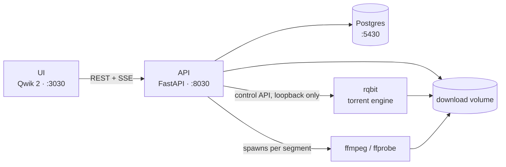
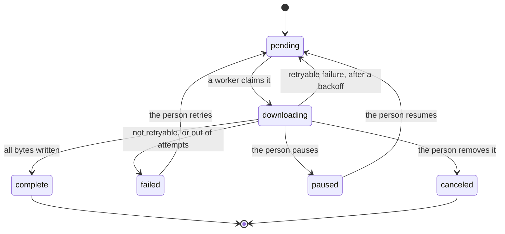

# Architecture

How the parts fit together, in one page. The detail behind each subsystem is in
its own spec under [docs/superpowers/specs](superpowers/specs); this is the map
that says which spec to open.

## The pieces

The API owns the database and every decision. It performs its own HTTP
downloads, but delegates torrent transfers to rqbit and all media work to
ffmpeg. Everything lands on one shared volume, which is why running the API on
the host while rqbit runs in Docker leaves the two disagreeing about paths.

Pages on media sites, YouTube among them, are read by yt-dlp inside the API,
behind one small interface in
[`api/src/lib/site/client.py`](../api/src/lib/site/client.py). It has two
calls:

- **`extract`** says what a page offers.
- **`resolve`** turns the chosen format ids into fresh URLs and headers, once
  per attempt, because those URLs expire and bind to the IP that asked.

The API's image ships Deno, which yt-dlp uses to solve YouTube's JavaScript
challenges.

Which format a preset means is decided in
[`api/src/lib/site/format.py`](../api/src/lib/site/format.py): the tallest
format not over the preset, plain HTTPS before HLS or DASH. The bytes of a
plain format go through the same segmented engine as a direct link. HLS and
DASH formats are left out until the fragment path exists, so a site that
offers nothing else is refused.

Throughput caps follow the same split. HTTP downloads share **one** limiter,
built once in [`api/src/service/__init__.py`](../api/src/service/__init__.py)
and handed to every worker and every segment, so `DOWNLOAD_RATE_LIMIT_BPS` caps
their total rather than each one's share. It paces the read side: a chunk
waits for its allowance before the next read, the socket's receive window
fills, and TCP slows the sender. Torrents are rqbit's to pace. The API only
tells it `TORRENT_DOWNLOAD_LIMIT_BPS` and `TORRENT_UPLOAD_LIMIT_BPS` (see the
torrent monitor below).

The UI's Settings modal has two halves. The preferences are the browser's own;
the only one the API ever sees is the API key, and only as a credential on each
request. The server half is `GET /settings`, fetched when the modal opens and
shown read-only, since changing any of it means editing `api/.env` and
restarting. `SettingsService` names each field it reports by hand, so a new
setting, or a secret, never appears there by accident.

Access is open unless `API_KEY` is set. When it is, every router but health's
carries a dependency, `require_api_key` in
[`api/src/core/auth.py`](../api/src/core/auth.py), that wants the key in
`X-API-Key` and compares it in constant time. Health stays open so a probe can
tell whether the API is up without holding a key. A few routes are opened by
the browser itself, which gives no way to add a header: the two event streams,
file downloads, and the HLS playlist and segments. Those alone also accept
`?api_key=`. A playlist fetched that way writes the key into its segment URIs,
which is what lets Safari's native player authenticate. A key in a URL is
redacted from uvicorn's access log and the error handlers' lines. In the UI,
the first 401 opens Settings on the key field.

## What runs in the background

Five loops start with the app and stop with it, in
[`api/src/main.py`](../api/src/main.py). None of them serve requests.

| Loop | Does | Setting |
|---|---|---|
| Worker pool | Claims queued tasks and performs HTTP downloads | `DOWNLOAD_WORKERS` concurrent slots |
| Torrent monitor | Polls rqbit and mirrors progress onto task rows | `TORRENT_POLL_MS` |
| Stream sweeper | Ends stream sessions nobody has touched | `STREAM_IDLE_TIMEOUT_S` |
| Torrent reaper | Deletes rqbit torrents no task or session owns | `TORRENT_REAP_POLL_S` |
| Disk monitor | Sends a `disk` event with free space every 30 s while a browser listens | none |

The reaper exists because the sweeper only knows about sessions this process
still holds in memory. A torrent orphaned by a lost `DELETE` or an API restart
would otherwise seed forever, so the reaper asks rqbit directly what it is
holding and compares that against the database.

The monitor also owns the torrent caps. rqbit keeps its limits in memory, so a
restart forgets them. The monitor pushes them on the first tick that reaches
the engine, and pushes them again whenever the engine has stopped answering
since, because from the API an unreachable engine is how a restart looks.

Startup also requeues orphans: with one process, every row left `downloading`
at boot belongs to a process that is gone, so it goes back in the queue and
resumes from its `.part` file.

## A download task's life

Workers move a task through the middle of that diagram; people move it along
the edges. A retry is the one transition that looks like nothing happened: the
status returns to `pending` with `next_attempt_at` set, which is why the card
shows a countdown rather than the word "queued".

Waiting for disk space takes the same shape. One `DiskGuard`, in
[`api/src/service/download/disk.py`](../api/src/service/download/disk.py),
keeps `DOWNLOAD_MIN_FREE_BYTES` free on `DOWNLOAD_DIR`'s disk, which is also
the disk rqbit writes to. It is checked in two places:

- **When a download is added.** A direct URL is checked against the minimum
  alone, since its size is unknown until a worker probes it. A site's plan
  counts its size too (exact, or yt-dlp's estimate), and so does a torrent's
  selection, checked before rqbit is asked. A refusal answers 507, and no row
  is written.
- **By the worker.** It checks before starting, again once the probe reveals a
  direct download's size, and when a write fails with `ENOSPC`. Each sends the
  task back to `pending` with `error_code=insufficient_storage` and a re-check
  in 30 s. The `.part` stays, and the attempt is handed back: waiting for space
  never uses up the retry budget.

A torrent that runs out of space mid-download is rqbit's to report; it arrives
as a free-text error the API does not interpret.

Removing is allowed from any status, not only the `downloading` edge drawn
above. It is a soft delete: the row becomes `canceled` with `deleted_at` set
and drops out of every list. The files go with it unless the request says
`delete_files=false`, which is accepted only for a `complete` or `seeding`
task and answered 409 otherwise. A half-finished `.part` would outlive its row
as bytes nothing can describe: the per-segment watermarks that say which ranges
are sound are cleared along with it.

`POST /download/bulk` is not a second path through this diagram. It picks the
rows an action applies to, then runs each through the same pause, resume or
remove a single click would, so a torrent is still handled by rqbit and a
direct download by its worker.

| Action | Rows |
|---|---|
| `pause_all` | `pending`, `downloading`, `seeding` |
| `resume_all` | `paused`, `failed` |
| `clear_finished` | `complete`, `failed`; a failure's files always go, a finished download's only with `delete_files` |

The server chooses the rows, not the client, and the choice lives in one place,
`BULK_SCOPES`. A row that refuses, most likely because its status changed a
moment earlier, is logged and skipped rather than failing the whole sweep. The
response reports how many rows were affected.

Torrents take the same statuses by a different route. The monitor writes them
from whatever rqbit reports, and adds `seeding`, which a finished torrent stays
in until someone stops it. `complete` is reachable for a torrent only by that
stop; the engine never produces it.

One status in the enum, `muxing`, is never assigned by anything today. The
schema and the UI both understand it, but no code path sets it.

## A stream session's life

Playing something and downloading it are independent. A stream never touches
the task table, and a download never feeds a player.

`POST /stream/start` probes the source, answers with a session id, and the
player then asks for `playlist.m3u8` and segments by index. **Segments are
transcoded when they are requested**, not in advance, with
`STREAM_READAHEAD_SEGMENTS` generated ahead of the one being fetched and
`STREAM_MAX_CONCURRENT_ENCODES` capping how many ffmpeg processes a session may
run at once. Seeking past the buffered edge therefore costs one encode, not a
wait for the whole file.

A page on a site adds a step in front too. The site client's `open` makes one
extraction, `playback_plan` picks video at up to 1080p (or an audio-only site's
audio) from the formats a download could fetch, and the session keeps one or
two inputs with the headers their server expects. Each segment's ffmpeg reads
both, with video from the first and audio from the second. Site URLs expire, so
an encode refused with a 403 resolves the page's formats again, once; segments
refused together share that refresh. A link to a media file skips the
extraction, and a link no site claims plays directly.

A torrent-backed stream adds a step in front: rqbit is asked for the torrent,
the largest media file is picked, and probing waits for enough of it to exist.
That wait is what the swarm HUD is for, and `STREAM_PROBE_TIMEOUT_S` is only a
safety net behind it.

Sessions end when the player says so, or when the sweeper notices nobody has
asked for a segment in `STREAM_IDLE_TIMEOUT_S`.

## Events

There is one `EventHub` for the whole process. Both SSE endpoints subscribe to
it and filter:

- `GET /download/events` sends a full task snapshot and one `disk` frame on
  connect, then `task` and `progress` frames as they happen, and `disk` from
  the disk monitor. The status bar's free-space stat reads those.
- `GET /stream/events` carries `stream_status` frames, including the swarm
  numbers for a torrent-backed session.

The snapshot on connect is what makes a dropped stream self-healing: the
browser reconnects on its own and the first frame replaces whatever went stale,
so the UI needs no polling to recover.

## Where the detail lives

| Subsystem | Spec |
|---|---|
| Segmented HTTP downloads | [2026-09-14](superpowers/specs/2026-09-14-segmented-downloads-design.md) |
| Torrent downloads | [2026-09-15](superpowers/specs/2026-09-15-torrent-downloads-design.md) |
| Direct-URL streaming | [2026-09-16](superpowers/specs/2026-09-16-direct-url-streaming-design.md) |
| Torrent streaming | [2026-09-16](superpowers/specs/2026-09-16-torrent-streaming-design.md) |
| Player controls | [2026-09-17](superpowers/specs/2026-09-17-custom-player-controls-design.md) |
| Swarm status in the player | [2026-09-17](superpowers/specs/2026-09-17-torrent-stream-swarm-status-design.md) |
