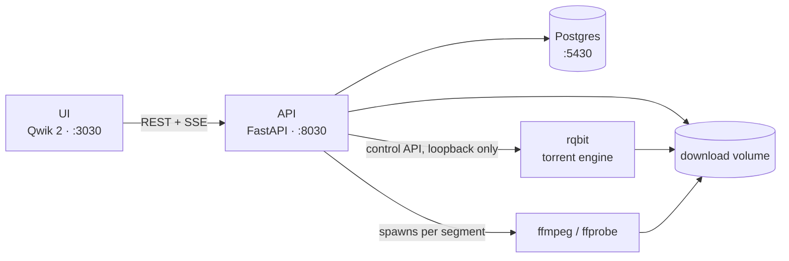
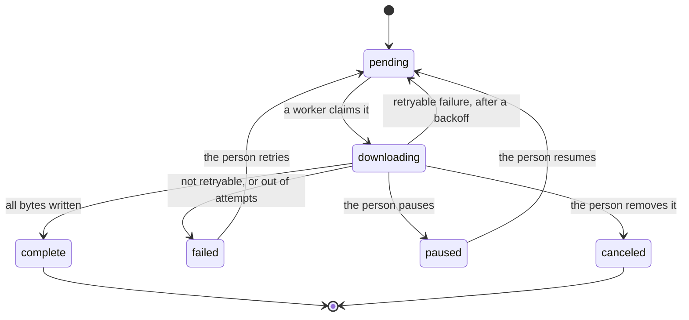

# Architecture

How the parts fit together, in one page. The detail behind each subsystem is in
its own spec under [docs/superpowers/specs](superpowers/specs); this is the map
that says which spec to open.

## The pieces

The API owns the database and every decision. It performs its own HTTP
downloads, but delegates torrent transfers to rqbit and all media work to
ffmpeg. Everything lands on one shared volume, which is why running the API on
the host while rqbit runs in Docker leaves the two disagreeing about paths.

## What runs in the background

Four loops start with the app and stop with it, in
[`api/src/main.py`](../api/src/main.py). None of them serve requests.

| Loop | Does | Setting |
|---|---|---|
| Worker pool | Claims queued tasks and performs HTTP downloads | `DOWNLOAD_WORKERS` concurrent slots |
| Torrent monitor | Polls rqbit and mirrors progress onto task rows | `TORRENT_POLL_MS` |
| Stream sweeper | Ends stream sessions nobody has touched | `STREAM_IDLE_TIMEOUT_S` |
| Torrent reaper | Deletes rqbit torrents no task or session owns | `TORRENT_REAP_POLL_S` |

The reaper exists because the sweeper only knows about sessions this process
still holds in memory. A torrent orphaned by a lost `DELETE` or an API restart
would otherwise seed forever, so the reaper asks rqbit directly what it is
holding and compares that against the database.

Startup also requeues orphans: with one process, every row left `downloading`
at boot belongs to a process that is gone, so it goes back in the queue and
resumes from its `.part` file.

## A download task's life

Workers move a task through the middle of that diagram; people move it along
the edges. A retry is the one transition that looks like nothing happened: the
status returns to `pending` with `next_attempt_at` set, which is why the card
shows a countdown rather than the word "queued".

Torrents take the same statuses by a different route. The monitor writes them
from whatever rqbit reports, and adds `seeding`, which a finished torrent stays
in until someone stops it. `complete` is reachable for a torrent only by that
stop; the engine never produces it.

One status in the enum, `muxing`, is never assigned by anything today. The
schema and the UI both understand it, but no code path sets it.

## A stream session's life

Playing something and downloading it are independent. A stream never touches
the task table, and a download never feeds a player.

`POST /stream/start` probes the source, answers with a session id, and the
player then asks for `playlist.m3u8` and segments by index. **Segments are
transcoded when they are requested**, not in advance, with
`STREAM_READAHEAD_SEGMENTS` generated ahead of the one being fetched and
`STREAM_MAX_CONCURRENT_ENCODES` capping how many ffmpeg processes a session may
run at once. Seeking past the buffered edge therefore costs one encode, not a
wait for the whole file.

A torrent-backed stream adds a step in front: rqbit is asked for the torrent,
the largest media file is picked, and probing waits for enough of it to exist.
That wait is what the swarm HUD is for, and `STREAM_PROBE_TIMEOUT_S` is only a
safety net behind it.

Sessions end when the player says so, or when the sweeper notices nobody has
asked for a segment in `STREAM_IDLE_TIMEOUT_S`.

## Events

There is one `EventHub` for the whole process. Both SSE endpoints subscribe to
it and filter:

- `GET /download/events` sends a full task snapshot on connect, then `task` and
  `progress` frames as they happen.
- `GET /stream/events` carries `stream_status` frames, including the swarm
  numbers for a torrent-backed session.

The snapshot on connect is what makes a dropped stream self-healing: the
browser reconnects on its own and the first frame replaces whatever went stale,
so the UI needs no polling to recover.

## Where the detail lives

| Subsystem | Spec |
|---|---|
| Segmented HTTP downloads | [2026-09-14](superpowers/specs/2026-09-14-segmented-downloads-design.md) |
| Torrent downloads | [2026-09-15](superpowers/specs/2026-09-15-torrent-downloads-design.md) |
| Direct-URL streaming | [2026-09-16](superpowers/specs/2026-09-16-direct-url-streaming-design.md) |
| Torrent streaming | [2026-09-16](superpowers/specs/2026-09-16-torrent-streaming-design.md) |
| Player controls | [2026-09-17](superpowers/specs/2026-09-17-custom-player-controls-design.md) |
| Swarm status in the player | [2026-09-17](superpowers/specs/2026-09-17-torrent-stream-swarm-status-design.md) |
