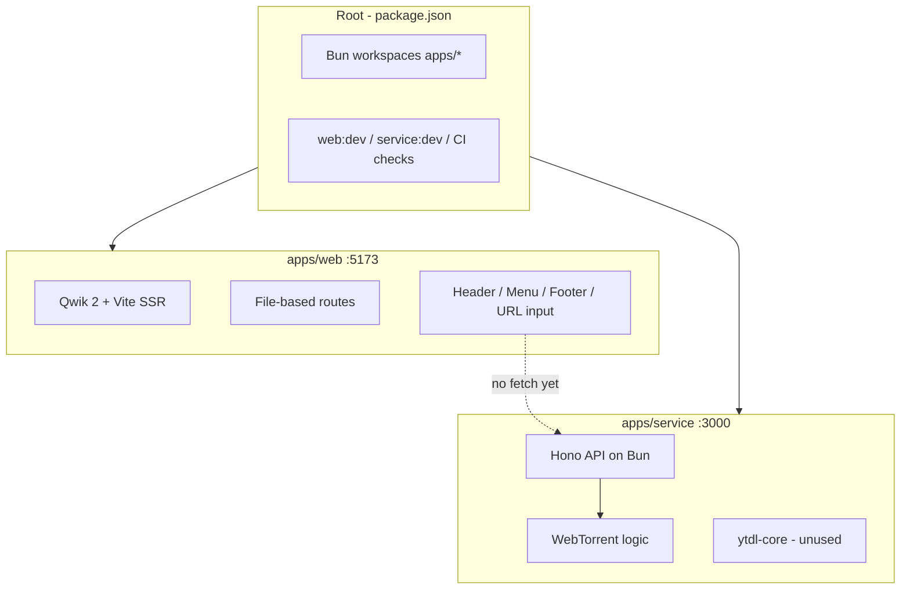
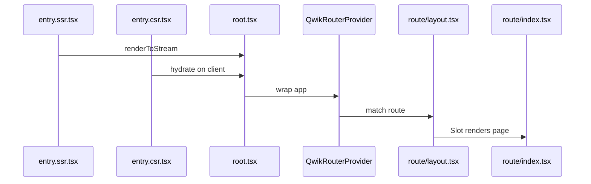
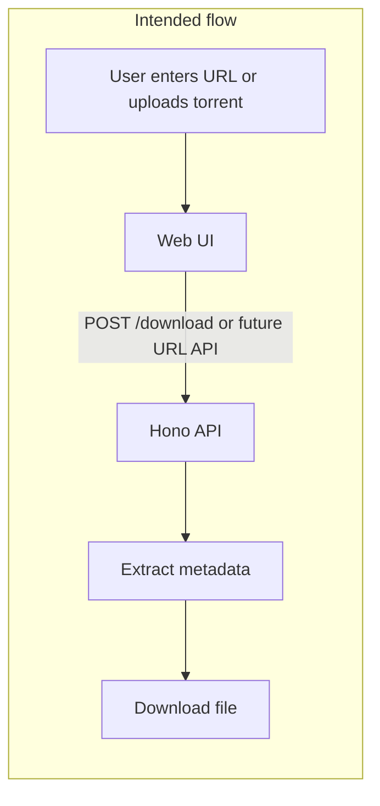

# AnyDM — How It Works Today

## What It Is

**AnyDM** (Any Download Manager) is a Bun workspace monorepo for extracting and downloading content from URLs and torrent files. It is early-stage: the UI shell and API skeleton exist, but the core download flow is not connected end-to-end.

**In the repo today:** 2 apps under [`apps/`](../apps/)  
**Planned but absent:** `packages/` (shared types/UI), `apps/desktop` (Tauri), `apps/mobile`

---

## Monorepo Layout



| Layer | Location | Role |
|-------|----------|------|
| Workspace root | [`package.json`](../package.json) | Orchestrates install, format, typecheck, dev for both apps |
| Web app | [`apps/web/`](../apps/web/) | Browser UI |
| Service app | [`apps/service/`](../apps/service/) | Backend API |
| CI | [`.github/workflows/ci.yml`](../.github/workflows/ci.yml) | Format + TypeScript checks on push/PR |

There are **no shared packages** yet — each app is fully independent (own deps, tsconfig, prettier config).

---

## Development Workflow

From repo root after `bun install`:

- **`bun run web:dev`** — formats + typechecks web, then starts Vite SSR dev server at **http://localhost:5173**
- **`bun run service:dev`** — formats + typechecks service, then starts Bun hot reload at **http://localhost:3000**

Root dev scripts always run Prettier + `tsc --noEmit` before starting servers. CI runs the same checks without starting servers.

---

## App 1: `apps/web` (Frontend)

### Stack
- **Qwik 2** with resumable SSR/CSR
- **Qwik Router** for file-based routing
- **Vite 7** + **Tailwind CSS 4**
- Path alias `@/*` → `src/*`

### Boot sequence



Key files:
- [`apps/web/src/entry.ssr.tsx`](../apps/web/src/entry.ssr.tsx) — server render
- [`apps/web/src/entry.csr.tsx`](../apps/web/src/entry.csr.tsx) — client hydration
- [`apps/web/src/root.tsx`](../apps/web/src/root.tsx) — app shell with `QwikRouterProvider` + `RouterOutlet`
- [`apps/web/vite.config.ts`](../apps/web/vite.config.ts) — routes live in `src/route/`

### Routing (only one real page today)

| File | URL | What it does |
|------|-----|--------------|
| [`src/route/layout.tsx`](../apps/web/src/route/layout.tsx) | wraps all routes | Header, Menu, Footer, `<Slot />` |
| [`src/route/index.tsx`](../apps/web/src/route/index.tsx) | `/` | Home — URL input + Extract button |

[`src/route/info.tsx`](../apps/web/src/route/info.tsx) exports an `Info` component but is **not routed or imported** anywhere.

### Home page behavior (current)

On submit, the home route:
1. Validates the URL with `new URL(...)` client-side
2. Reads `PUBLIC_BASE_URL` from env (see [`apps/web/.env.example`](../apps/web/.env.example))
3. Logs the base URL to console
4. **Does not call the API** — the fetch logic is not implemented (line 36 is a commented placeholder)

```31:36:apps/web/src/route/index.tsx
            const BASE_URL = import.meta.env.PUBLIC_BASE_URL;
            if (!BASE_URL) {
                throw new Error("PUBLIC_BASE_URL is missing");
            }
            console.log("BASE_URL: ", BASE_URL);
            //new URL(store.url);
```

### Component pattern

Each UI piece follows a consistent folder structure:

```
component/<name>/
├── index.tsx    # barrel re-export
├── field.tsx    # implementation
└── field.css    # co-located styles
```

Components: `header`, `menu`, `footer`, `button`, `input/url`.

### Placeholder UI
- Nav/footer links to `/about`, `/contact`, `/privacy`, `/terms` — **no routes exist**
- Several declared deps (`@qwik-ui/headless`, `@qwikest/icons`, etc.) are **not used in source yet**

---

## App 2: `apps/service` (Backend API)

### Stack
- **Bun** runtime (serves TypeScript directly, no build step)
- **Hono 4** web framework
- **WebTorrent** — torrent download implementation exists
- **ytdl-core** — installed but **no routes use it**

### Entry point

[`apps/service/src/index.ts`](../apps/service/src/index.ts) exports a default Hono app. Bun auto-serves it on port **3000** when you run `bun run dev`.

Middleware configured:
- Request logging
- CORS for `http://localhost:5173` and `http://127.0.0.1:5173` (web dev origins)
- Global 500 error handler and 404 handler

### Endpoints

| Method | Path | Status |
|--------|------|--------|
| `GET /` | Health check | Returns `"Hello Bun!"` |
| `POST /download` | Torrent upload | **Stubbed** — validates input but success response is commented out |

### Torrent download logic

[`apps/service/src/route/download.ts`](../apps/service/src/route/download.ts) has a fully implemented `downloadTorrent(torrentFile: File)` function:
- Creates a WebTorrent client
- Writes to OS temp directory
- Tracks progress via events
- Returns `{ message, name, path }` on completion

But the POST handler **never calls it** — the success path is commented out:

```83:90:apps/service/src/route/download.ts
    try {
        /* const result = await downloadTorrent(torrentFile as File);
        return context.json({
            success: true,
            message: result.message,
            fileName: result.name,
            savedPath: result.path, // optional
        });*/
```

So `POST /download` with a valid torrent file currently returns **no response body** (implicit 200 with empty body).

There is **no URL extraction endpoint** yet — the web app's URL input has nothing to call on the API side.

---

## How the Apps Relate (Today vs. Intended)



**Current reality:**
- Web validates URLs locally only; env var `PUBLIC_BASE_URL` is read but unused for HTTP calls
- Service has torrent logic ready but the route handler does not invoke it
- No shared TypeScript types between apps
- CORS is pre-configured so integration should be straightforward once wired

---

## CI Pipeline

[`.github/workflows/ci.yml`](../.github/workflows/ci.yml) on push/PR to `main`/`master`:

1. `bun install --frozen-lockfile`
2. `bun run web:fmt.chk && bun run web:chk`
3. `bun run service:fmt.chk && bun run service:chk`

No build, no integration tests, no E2E yet.

---

## Summary: What Works vs. What's Missing

| Area | Works today | Not yet |
|------|-------------|---------|
| Monorepo tooling | Bun workspaces, root scripts, CI | Shared `packages/` |
| Web UI | Layout, URL input, client validation, loading state | API calls, result display, extra routes |
| Service API | Health check, CORS, torrent download function | Active `/download` response, URL/YouTube routes |
| Integration | CORS + env var scaffolded | Web ↔ API fetch, shared types |
| Future apps | — | Desktop (Tauri), mobile |

The project is a **well-scaffolded two-app split** with dev tooling ready. The next logical steps would be: uncomment/wire `POST /download`, add a URL extraction endpoint, connect the web form via `fetch`, and optionally introduce a `packages/types` workspace for shared contracts.
